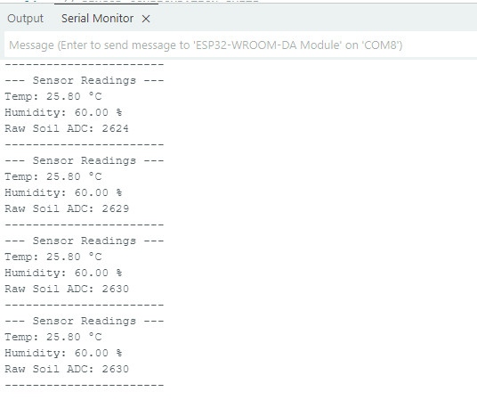
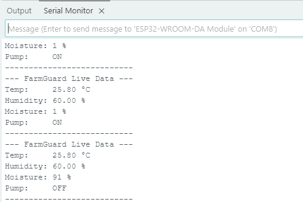

# Level 2: Sensor-Actuator Interface & Local Control

**Status:** Completed  
**Domain:** Embedded Hardware (Node 01)  
**Microcontroller:** ESP32-WROOM-32  

## 🎯 Objective
To establish a local, offline control loop. The system must reliably read environmental data (temperature, humidity, soil moisture) and autonomously trigger a water pump actuator based on hardcoded thresholds, ensuring crop safety even if the network fails.

## 🔌 Hardware Pin Mapping
* **Status LED:** GPIO 21
* **Manual Override Button:** GPIO 22 (Internal Pull-up)
* **DHT11 (Temp/Humidity):** GPIO 4
* **Capacitive Soil Moisture:** GPIO 34 (ADC1_CH6)
* **1-Channel 5V Relay:** GPIO 5

## 🧮 Sensor Calibration & Logic
### Soil Moisture Mapping
The capacitive sensor outputs raw analog data. We calibrated this to a 0-100% scale using the Arduino `map()` function based on physical bench tests:
* **Absolute Dry (AirValue):** 2654
* **Absolute Wet (WaterValue):** 1200 
*(Values constrained to prevent negative percentages).*

### Actuator Control Logic
* **Irrigation Threshold:** 35%
* **Relay Type:** Active LOW (Sending a `LOW` signal activates the pump).
* **Failsafe:** If the system is manually paused via the physical button, the pump is forced to `HIGH` (OFF) regardless of soil readings.

## 📸 Verification Screenshots

### 1. Serial Monitor: Raw Calibration Data
*(This screenshot proves the initial analog reading of 2654 in dry air before percentage mapping).*

### 2. Serial Monitor: Active Control Loop
*(This screenshot shows the formatted Dashboard output with Temp, Humidity, % Moisture, and the Pump triggering ON/OFF).*

## 📦 Dependencies
* `DHT sensor library` by Adafruit
* `Adafruit Unified Sensor`