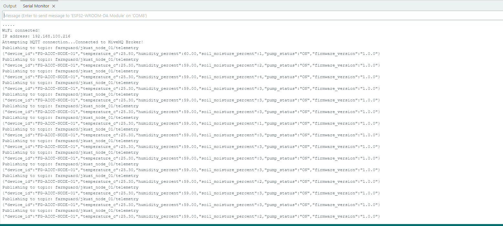
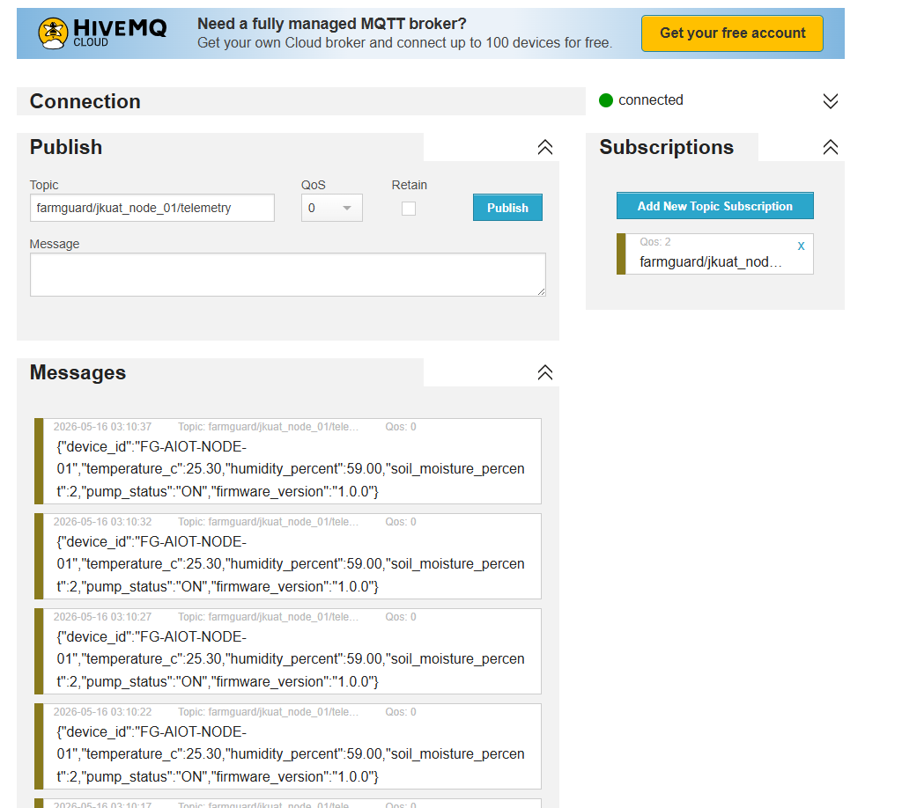

# Level 3: IoT Connectivity & Telemetry

**Status:** Completed  
**Domain:** Embedded Hardware & Networking  
**Microcontroller:** ESP32-WROOM-32  

## 🎯 Objective
To upgrade the local control loop into a connected IoT node. The system must establish a stable WiFi connection, format the sensor data into a strict JSON payload, and publish it to a cloud MQTT broker over the internet.

## 🌐 Network & MQTT Configuration
* **WiFi Protocol:** WPA2-Personal (Local Hotspot/Router)
* **MQTT Broker:** `broker.hivemq.com` (Public Test Server)
* **MQTT Port:** `1883` (Unencrypted TCP)
* **Publish Topic:** `farmguard/jkuat_node_01/telemetry`
* **Telemetry Rate:** 1 payload every 5 seconds (Non-blocking)

## 📦 Data Contract (JSON Payload Structure)
The ESP32 successfully constructs and transmits the following telemetry structure:
```json
{
  "device_id": "FG-AIOT-NODE-01",
  "temperature_c": 25.80,
  "humidity_percent": 60.00,
  "soil_moisture_percent": 0,
  "pump_status": "ON",
  "firmware_version": "1.0.0"
}

## 📸 Verification Screenshots

### 1. Serial Monitor: Local Sensor Reading & Cloud Publish
*(This screenshot proves the ESP32 is successfully reading the DHT11 and Soil Moisture sensors and formatting them into the JSON string).*




### 2. HiveMQ Web Client: Live Cloud Telemetry
*(This screenshot demonstrates the structured JSON payload arriving successfully at the public cloud broker, verifying the MQTT pipeline).*



## 📦 Dependencies
* `WiFi.h` (Built-in ESP32 core library)
* `PubSubClient` by Nick O'Leary (For MQTT communication)
* `DHT sensor library` by Adafruit
* `Adafruit Unified Sensor`